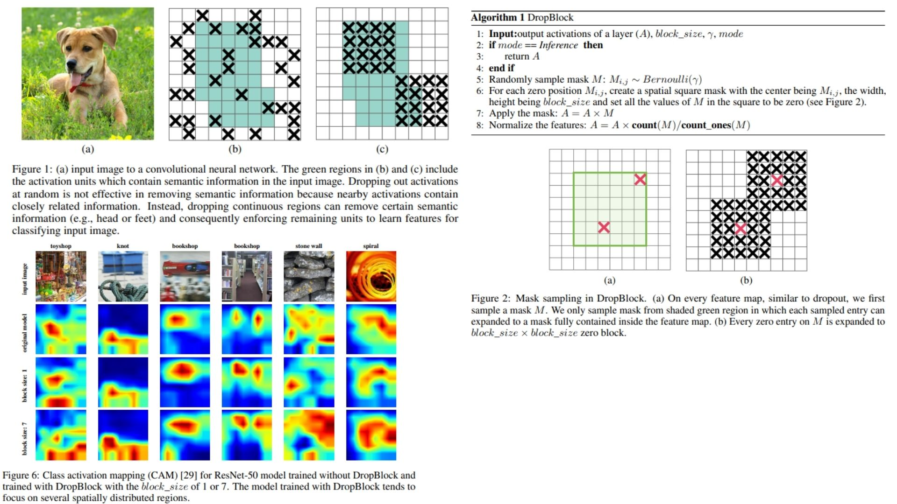
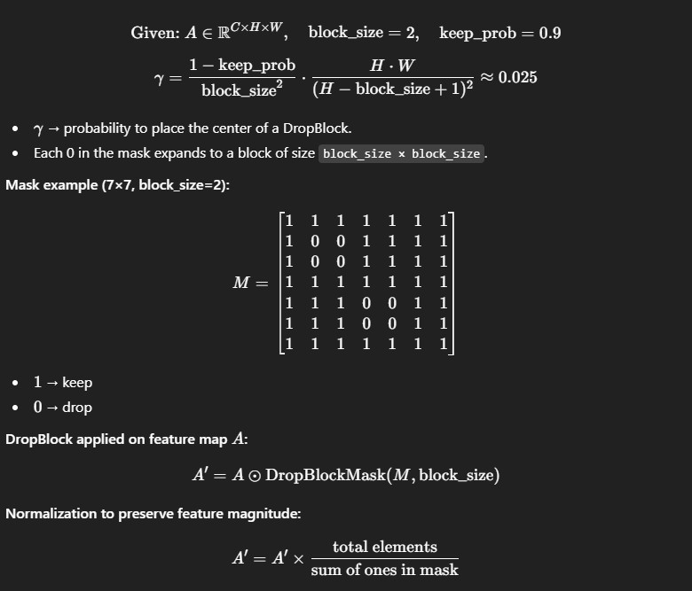

# 🌸 DropBlock PyTorch Implementation

This repository contains a PyTorch implementation of **DropBlock**, a structured dropout method for **convolutional networks**. The goal is to regularize spatially correlated feature maps by **dropping contiguous blocks** instead of individual units, improving robustness and generalization.  

- DropBlock applied **within convolutional layers** and optionally in skip connections.  
- Gradually increase dropped units during training for better performance.  
- Architecture:  
**Input → Backbone with DropBlock → FPN-like feature processing → Segmentation Head → Output**  

**Paper reference:** [DropBlock: A Regularization Method for Convolutional Networks](https://arxiv.org/abs/1810.12890) 🐻

---

## 🖼 Overview – DropBlock Architecture

  

This overview summarizes the DropBlock pipeline across key stages of the network:

- **Input:** Original image is passed through the network.  
- **Backbone:** Feature maps are extracted using a ResNet backbone with DropBlock applied in convolutional layers.  
- **Feature Processing:** FPN-like module combines features across scales to enhance representation.  
- **DropBlock Application:** Contiguous blocks of activations are dropped according to a scheduled probability, forcing the network to learn diverse features.  
- **Segmentation Head:** Processed features are passed through 2 convolution layers to produce the final segmentation map.  

The model enforces robustness by preventing reliance on local correlated activations, improving generalization for segmentation tasks.

---

## 🧮 Key Mathematical Idea

  

- Let $$(A \in \mathbb{R}^{C \times H \times W}\)$$ be the feature map.  
- Create a binary mask $$(M\)$$ with probability $$(\gamma\)$$:  

$$
M_{i,j} \sim \text{Bernoulli}(\gamma)
$$

- Expand each zero in \(M\) to a block of size \( \text{block size} \times \text{block size} \):  

$$
A' = A \odot \text{DropBlockMask}(M, \text{block size})
$$
  
- Normalize to preserve feature magnitude:  

$$
A' = A' \times \frac{\text{total elements}}{\text{sum of ones in mask}}
$$

**Example mask (7×7, block size = 2, keep\_prob = 0.9):**

$$
M = 
\begin{bmatrix}
1 & 1 & 1 & 1 & 1 & 1 & 1 \\
1 & 0 & 0 & 1 & 1 & 1 & 1 \\
1 & 0 & 0 & 1 & 1 & 1 & 1 \\
1 & 1 & 1 & 1 & 1 & 1 & 1 \\
1 & 1 & 1 & 0 & 0 & 1 & 1 \\
1 & 1 & 1 & 0 & 0 & 1 & 1 \\
1 & 1 & 1 & 1 & 1 & 1 & 1
\end{bmatrix}
$$

- `1` → keep  
- `0` → drop  

---

## 🏗️ Model Architecture

```bash
DropBlock-Replication/
│
├── src/
│   ├── layers/
│   │   ├── conv_block.py           # Conv + BN + ReLU + optional DropBlock hook
│   │   ├── dropblock_layer.py      # only DropBlock regularizer
│   │   ├── residual_block.py
│   │   ├── fpn_block.py
│   │   └── output_seg_head.py
│   │
│   ├── modules/
│   │   ├── backbone_resnet.py
│   │   ├── feature_processor.py    # (previous roi_processor)
│   │   └── schedule_dropblock.py   # scheduler should stay here
│   │
│   ├── model/
│   │   └── dropblock_model.py
│   │
│   └── __init__.py                # boş bile olsa koy
│
├── images/
│   ├── figures.jpg
│   └── math.jpg
│
├── requirements.txt
└── README.md
```
---


## 🔗 Feedback

For questions or feedback, contact: [barkin.adiguzel@gmail.com](mailto:barkin.adiguzel@gmail.com)
